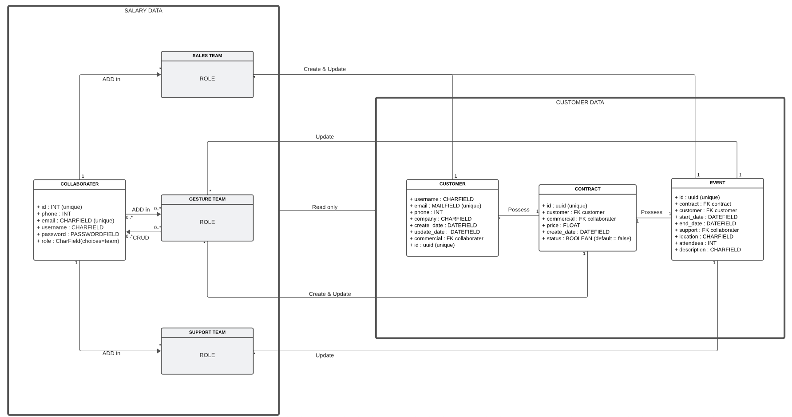
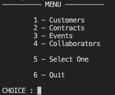
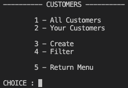
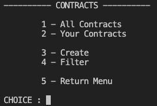
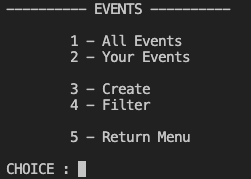
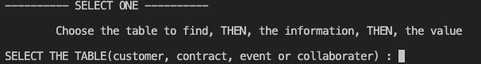
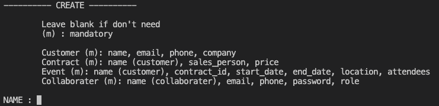
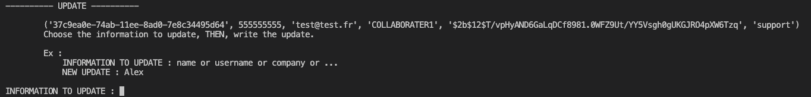

# Epic-Events

***OC - Project 12 - Back-end sécurisé Python SQL***

>This project is a command line only CRM *(Customers Relationship Management)* using PostgreSQL database. **Full Python code**.

Before to run the project, be sure to have **Python** and **PostgreSQL** installed in your machine.  

Follow these links to install them :  
- **Python : https://www.python.org/downloads/**
- **PostgresSQL : https://www.postgresql.org/download/**

>*Optionnal, pgAdmin is an interactive UX for PostgreSQL :*
>*https://www.pgadmin.org/download/*

---

## 1 - Init project

1. Clone the repository in your working folder and create a venv. 
 

2. Install packages from the requirements.txt :
        `$ pip install -r requirements.txt`
 

3. When everything is ok, you have to create **.env** file in which you'll put the ***database informations*** and a ***secret key*** to allow JWS Token. 
    - E.g. : 
            
>DB_USER=root  
>DB_PASSWORD=password  
>DB_HOST=localhost  
>DB_PORT=5432  
>DB_NAME=postgres  
>KEY=secrettoken102023  

You can eventually add a Sentry DNS by adding
>DNS=***your_dns***

---

## 2 - Run and connect to the project

First, add a generic admin user in your collaborater table. Be sure to use a ***hashed password using bcrypt***.
 
Now, you can finally enter the project by typing `$ python main.py` and loggin with your admin user.
 

---

>1. Where to find all customers informations
>2. Everything you have to know about contracts
>3. All the events
>4. Show the collaborators.
>5. Can select any entity to update or delete it.
>6. Quit and return to loggin

 

---

  

>1. Display all entities 
>2. Display only entities refered to you
>3. Create a new entity
>4. Show filter menu
>5. Return

 

---

>Can select an entity from the database. First, you have to select the **table**, then the **information** and the **value** that permit to find it. 

 

---

>There is only one view to create any of the entity you want. You just have to type mandatories informations. 
>*E.g. (for a collaborater):* 
>NAME: **COLLABORATER1**  
>EMAIL: **test@test.fr**  
>PHONE: **0555555555**  
>COMPANY:  
>SALES PERSON:  
>PRICE:  
>CONTRACT ID:  
>START DATE:  
>END DATE:  
>LOCATION:  
>ATTENDEES:  
>DESCRIPTION:  
>ROLE (support, gesture or sale): **support**  
>PASSWORD (only for collaborator): **P@$$W0RD**  

 

---

>To update a selected entity, you have to type first the information to update as **name**(for customer), **username**(for collaborater) or any other information as **company**, **phone**, **email**, ... Then type the new value. 

 

---
Enjoy the experience !
*Do not hesitate to report any error*

